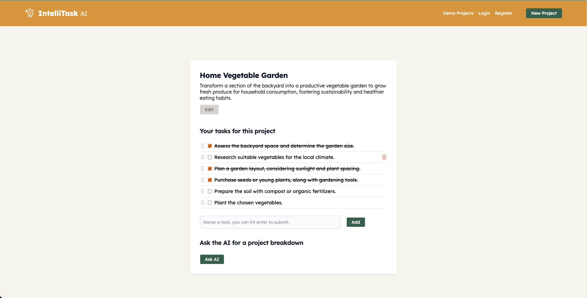

# IntelliTask AI

Welcome to the _frontend repository_ of IntelliTask AI, an AI-enhanced project management app.

[Click here](https://intellitask-ai.netlify.app/) to try the app !

## 📜 Description

**IntelliTask AI** lets users effortlessly obtain task breakdowns for their projects by leveraging the power of AI. With our platform, users can:

1. Create an account.
2. Initiate projects on a dedicated page.
3. Provide a description for the AI to understand the goals.
4. Let the AI suggest a task breakdown in seconds.
5. Write tasks and keep track of progress.

**IMPORTANT: This repository is for the Frontend (React) part of IntelliTask AI.** A repository with the backend code can be found [here](https://github.com/IntelliTask-Team/IntelliTask-AI-Server).



🚀 **Demo**: Check out our deployed app [here](https://intellitask-ai.netlify.app/).

## 💻 Stack (Front-end)

- **React JS**: 18.2.0
- **Tailwind CSS**: ^3.3.3
- **Vite**: ^4.4.5"

## ✏ Configuration

Before getting started, ensure you set the necessary environment variables for the project. Create a `.env` file at the root of this project. Here's what you'll need:

```
VITE_API_URL=Your backend URL. Default is http://localhost:5000
```

## ⚡ Usage

### Installation

Install the required dependencies for the frontend:

```bash
npm install
```

### Running the App

To run the IntelliTask AI frontend on your local machine:

```bash
npm run start
```

This command will launch the React app, and you should be able to access it at `http://localhost:3000` or whichever port you've specified.

## 🔗 Related Repositories

- **Backend**: The repository for the backend (Express API) code can be found [here](https://github.com/IntelliTask-Team/IntelliTask-AI-Server).

## 🤝 Contributors

- Alexis Parsat-Lacoste
- Kim Idsinga

---

Happy project managing with IntelliTask AI! 🚀
